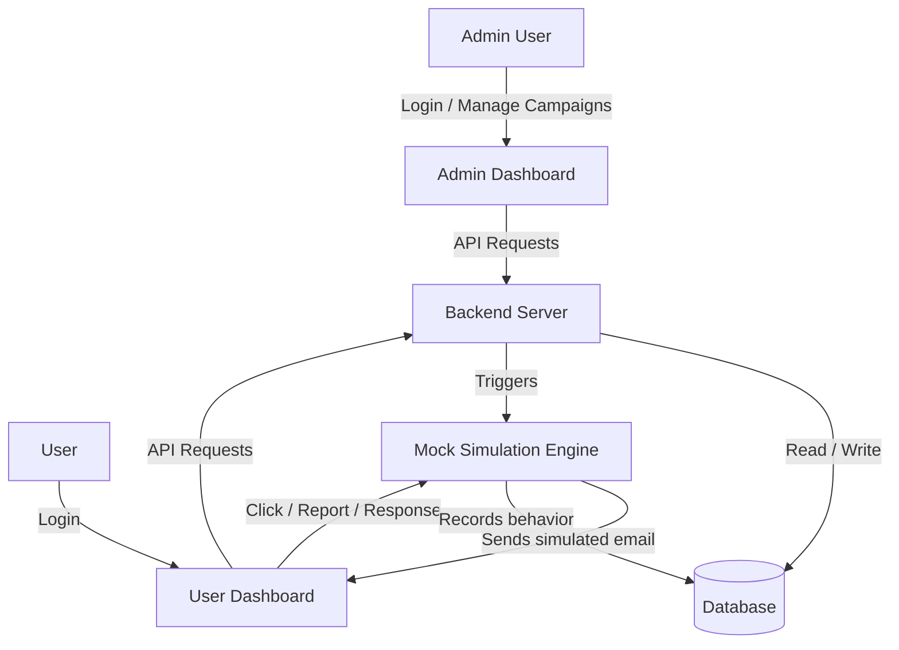
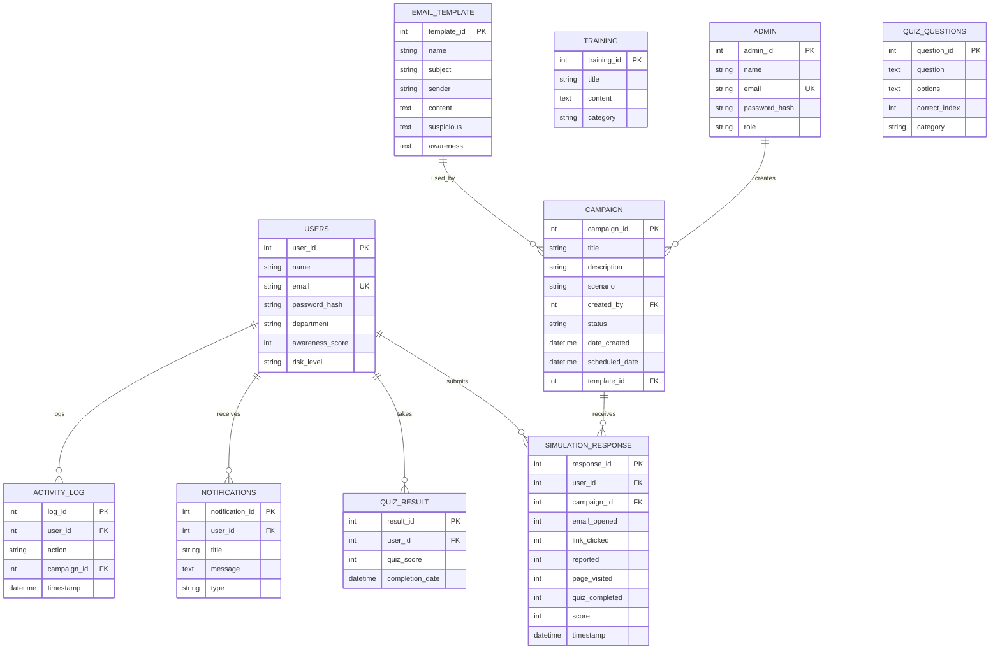

# CyberSec Dashboard — Design Document

## 1. System Architecture (Mermaid)



## 2. Database ER Diagram



## 3. Admin Dashboard Wireframe

```
┌────────────────────────────────────────────────────────────────────────────┐
│ CyberSec Admin │  Dashboard   Users  Campaigns  Templates  Analytics  ... │
├──────────────┬─────────────────────────────────────────────────────────────┤
│              │  Dashboard Overview                                        │
│  Dashboard   │  ┌──────────┐ ┌──────────┐ ┌──────────┐ ┌──────────┐     │
│  Users       │  │ Users    │ │ Campaigns│ │ Emails   │ │ Responses│     │
│  Campaigns   │  │ 248      │ │ 12       │ │ 1,204    │ │ 986      │     │
│  Templates   │  └──────────┘ └──────────┘ └──────────┘ └──────────┘     │
│  Responses   │  ┌──────────┐ ┌──────────┐ ┌──────────┐ ┌──────────┐     │
│  Analytics   │  │Awareness │ │High-Risk │ │Ongoing   │ │ Success  │     │
│  Reports     │  │ 78%      │ │ 23       │ │8         │ │ Rate 82% │     │
│  Settings    │  └──────────┘ └──────────┘ └──────────┘ └──────────┘     │
│              │  ┌──────────────────┐  ┌──────────────────┐               │
│              │  │ User Awareness   │  │ Risk Distribution│               │
│              │  │  [ LINE CHART ]  │  │  [ DONUT CHART ] │               │
│              │  └──────────────────┘  └──────────────────┘               │
│              │  ┌──────────────────┐  ┌──────────────────┐               │
│              │  │ Simulation Stats │  │ Monthly Activity │               │
│              │  │  [ BAR CHART ]   │  │  [ BAR CHART ]   │               │
│              │  └──────────────────┘  └──────────────────┘               │
│              │  Recent Activities: [activity timeline list]               │
└──────────────┴─────────────────────────────────────────────────────────────┘
```

## 4. User Dashboard Wireframe

```
┌────────────────────────────────────────────────────────────────────────────┐
│ CyberSec Learn │  Dashboard  Simulations  Training  Quiz  Results  Profile│
├──────────────┬─────────────────────────────────────────────────────────────┤
│              │  Welcome, Alice!  [Start Simulation]                       │
│  Dashboard   │  ┌──────────┐ ┌──────────┐ ┌──────────┐ ┌──────────┐     │
│  Simulations │  │ Total    │ │Awareness │ │ Security │ │ Pending  │     │
│  Training    │  │ Sim      │ │ Score    │ │ Level    │ │ Sim      │     │
│  Quiz        │  │ 3        │ │ 85%      │ │ Low      │ │ 1        │     │
│  Results     │  └──────────┘ └──────────┘ └──────────┘ └──────────┘     │
│  Profile     │  ┌──────────────────┐  ┌──────────────────┐               │
│              │  │ Awareness Score  │  │ Notifications    │               │
│              │  │   [ SCORE RING ] │  │ • New training   │               │
│              │  │   85% / Low Risk │  │ • Simulation     │               │
│              │  └──────────────────┘  │ • Security tip   │               │
│              │                        └──────────────────┘               │
│              │  Security Tips: [3 tip cards]                              │
└──────────────┴─────────────────────────────────────────────────────────────┘
```

## 5. Implementation Explanation

- **Backend**: Python Flask exposes a REST API. JWT (implemented with Python's standard library `hmac` + `hashlib`) handles authentication with role-based access control (`admin_required` / `token_required` decorators). Passwords are hashed with SHA-256 as a lightweight demo implementation.
- **Database**: SQLite with a schema matching the required tables (admin, users, campaign, simulation_response, training, quiz_result) plus supporting tables (email_template, quiz_questions, notifications, activity_log).
- **Simulation Engine**: Records user interaction events (email_opened → link_clicked / reported / page_visited / quiz_completed) and derives a score and risk level. Reported = 100 (Low risk), link_clicked = 30 (High risk), email_opened = 50 (Medium risk).
- **Charts**: Chart.js renders awareness trends, risk distribution, simulation stats, monthly activity, and department comparisons.
- **Reports**: The admin reports module aggregates data and supports PDF (via print dialog) and CSV export.
- **Frontend**: Two SPAs (admin + user) using Bootstrap 5, with a shared dark cybersecurity theme for admin and a clean learning theme for users.
</content>
