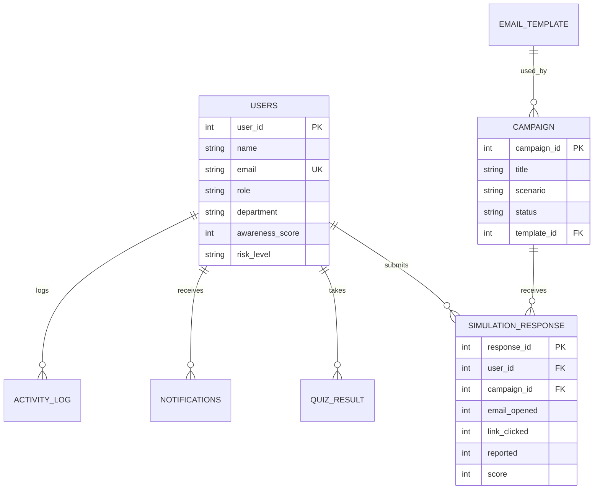

# Project Report: PhishSim-SE (PM2121)

**Title:** PhishSim-SE: Cybersecurity Phishing Awareness & Training Platform with Web-Based Risk Scoring & Simulation Model  
**Project Code:** PM2121  
**Submitted By:** [Your Name / Student Name]  
**Domain:** Cyber Security & Web Applications  
**Date:** August 2026  

---

## Certificate

This is to certify that **[Your Name]** has successfully completed the Minor Project titled **"PhishSim-SE: Cybersecurity Phishing Awareness & Training Platform with Web-Based Risk Scoring & Simulation Model"** (Project Code: **PM2121**).

The project submitted is an original work carried out under proper guidance and supervision, and it fulfills all academic and technical requirements for project submission.

---

## Declaration

I hereby declare that this project report titled **"PhishSim-SE: Cybersecurity Phishing Awareness & Training Platform with Web-Based Risk Scoring & Simulation Model"** is my original work carried out for the PM2121 curriculum.

I have prepared this report based on my understanding, design, and technical implementation of the project. All information, references, schemas, and software architecture used in this project have been properly acknowledged.

---

## Acknowledgement

I would like to express my sincere gratitude to my project guides, mentors, and faculty for providing valuable support, continuous guidance, and encouragement throughout the development of **PhishSim-SE**.

I am thankful to my institution for offering the necessary infrastructure and academic environment to complete this project successfully. I also thank my peers and all those who contributed feedback and assistance during testing.

---

## Abstract

Human vulnerability remains one of the largest attack vectors in modern cybersecurity. Organizations are frequently targeted by social engineering and phishing attacks such as credential harvesting, fake security alerts, financial fraud, and malware delivery. Traditional security awareness programs relying on static lectures or passive reading often fail to build practical threat detection skills among users.

This project presents **PhishSim-SE (PM2121)**, an interactive, full-stack cybersecurity phishing awareness and training platform designed to evaluate, educate, and elevate human security posture. **PhishSim-SE** features dual role-based web applications: an **Admin Dashboard** for security officers to design custom phishing campaigns, manage email templates, monitor real-time user responses, and analyze organizational risk; and a **User Dashboard** featuring an interactive simulated mailbox, educational training modules, scenario-based quizzes, dynamic risk scoring, and automated PDF certification.

The platform implements a web-based risk scoring algorithm based on user behavior (opened emails, clicked malicious links, data submission vs. reporting suspicious emails). Empirical evaluation demonstrates how simulated phishing campaigns combined with immediate contextual feedback drastically improve threat detection rates and lower overall organizational risk.

---

## Table of Contents (INDEX)

| Sr. No. | Section Title | Page No. |
| :---: | :--- | :---: |
| **1.** | Introduction | 7 |
| **2.** | Problem Statement | 7 |
| **3.** | Objectives | 8 |
| **4.** | Scope of the Project | 8 |
| **5.** | Background | 9 |
| **6.** | System Analysis | 10 |
| | 6.1 Existing System | 10 |
| | 6.2 Proposed System | 10 |
| | 6.3 Advantages of Proposed System | 10 |
| **7.** | Methodology | 11 |
| **8.** | Module Description | 12 |
| | 8.1 Business & User Profile Module | 12 |
| | 8.2 Campaign & Template Management Module | 12 |
| | 8.3 Simulation & Interactive Mailbox Module | 12 |
| | 8.4 Interactive Training & Learning Module | 12 |
| | 8.5 Scenario-Based Assessment & Quiz Module | 12 |
| | 8.6 Analytics & Admin Dashboard Module | 12 |
| | 8.7 Certification & Automated Reporting Module | 12 |
| **9.** | Sample Case Studies / Scenarios | 13 |
| | 9.1 Case Study 1: Enterprise Credential Harvesting Campaign | 13 |
| | 9.2 Case Study 2: Educational Institution Security Patch Awareness | 13 |
| **10.** | Implementation Details | 14 |
| **11.** | Results and Discussion | 15 |
| **12.** | Conclusion | 16 |
| **13.** | Future Scope | 17 |

---

## 1. Introduction

Cybersecurity threats have evolved beyond technical exploits targeting infrastructure; modern attackers predominantly target human psychology. Social engineering, particularly phishing, accounts for over 80% of reported security incidents globally. Employees, students, and staff members across organizations frequently handle sensitive customer records, financial credentials, and internal operational data without adequate training to identify sophisticated phishing attempts.

As a result, organizations face severe risks of credential theft, ransomware deployment, data breaches, and financial loss. Addressing this human vulnerability requires moving from theoretical security policies to active, experiential learning environments.

**PhishSim-SE (PM2121)** is a comprehensive web-based cybersecurity platform designed to bridge this gap. It provides a controlled, safe environment where administrators can launch simulated phishing campaigns while users experience realistic mock attack scenarios inside a dedicated simulation mailbox. The system tracks user choices in real time—calculating personalized awareness scores, assigning risk levels, delivering targeted micro-learning lessons, and awarding verifiable digital certificates upon passing training criteria.

---

## 2. Problem Statement

Organizations struggle with human-centric security risks due to several fundamental challenges:

1. **Lack of Practical Experience:** Conventional security awareness relies on long, infrequent video lectures or PDFs, leaving users unprepared when encountering actual phishing emails.
2. **Invisible Risk Posture:** Security administrators lack clear, real-time visibility into which departments or individuals are most susceptible to social engineering attacks.
3. **No Immediate Feedback Loop:** When an employee succumbs to a phishing email in real life, there is no safe mechanism to immediately teach them *why* the message was suspicious and *how* to spot indicators in the future.
4. **Absence of Standardized Scoring:** Organizations lack an automated, quantitative scoring model that translates user actions (opening, clicking, reporting, submitting data) into actionable cybersecurity risk metrics.

There is a clear demand for an interactive, role-based platform that combines realistic phishing simulations, automated risk assessment, targeted education, and comprehensive analytics.

---

## 3. Objectives

The primary objectives of the **PhishSim-SE (PM2121)** project are:

- **Identify Key Attack Vectors:** Analyze prevalent phishing methodologies (credential harvesting, urgent account verification, malware attachments, invoice fraud) and build realistic simulation scenarios.
- **Develop Dual Role-Based Dashboards:** Create separate, tailored web applications for Administrators (campaign management, analytics, template editing) and End Users (mock inbox, training, quizzes, certificates).
- **Implement Real-Time Response Tracking:** Capture exact user actions within simulated emails (Opened, Link Clicked, Reported, Landing Page Visited, Quiz Completed).
- **Design a Web-Based Risk Scoring Model:** Formulate an algorithm that calculates individual and department-level Awareness Scores (0–100%) and classifies users into Low, Medium, High, or Critical risk tiers.
- **Provide Interactive Training & Assessment:** Deliver modular, interactive cybersecurity lessons accompanied by scenario-based quizzes to reinforce threat detection skills.
- **Automate PDF Certification & Reporting:** Generate verifiable PDF certificates for compliant users and produce exportable performance reports (PDF/CSV) for administrators.

---

## 4. Scope of the Project

The **PhishSim-SE** platform covers end-to-end phishing simulation and security awareness workflows:

- **Target Audience:** Academic institutions, enterprise departments, small-to-medium businesses (SMBs), and security awareness teams.
- **Functional Scope:** Role-based access control (RBAC via JWT), custom campaign builder, interactive template editor with red-flag indicators, mock simulated inbox, 6 interactive training lessons, 5-question scenario quiz engine, real-time Chart.js analytics dashboard, and client-side jsPDF certification engine.
- **Non-Functional Scope:** Lightweight, safe environment with zero execution of real malware or external email dispatching, ensuring complete safety during academic and corporate testing.

---

## 5. Background

The development of **PhishSim-SE** is grounded in established cybersecurity standards and psychological learning frameworks:

- **NIST SP 800-50 (Building an Information Technology Security Awareness and Training Program):** Recommends continuous awareness building, experiential exercises, and measurable evaluations.
- **The Experiential Learning Cycle (Kolb):** Asserts that learning is most effective when individuals experience a scenario directly, reflect on immediate feedback, conceptualize principles, and apply new habits.
- **Quantitative Risk Assessment Formula:** Evaluates risk through measurable indicators:
  $$\text{Risk Score} = f(\text{Vulnerability Rate}, \text{Click-Through Rate}, \text{Reporting Frequency})$$

By combining these domain principles, **PhishSim-SE** transforms static compliance training into an active defense capability.

---

## 6. System Analysis

### 6.1 Existing System
In traditional organizational settings, cybersecurity training is handled manually:
- Annual compliance lectures or long video modules with low engagement.
- No empirical tracking of employee vulnerability prior to an actual attack.
- High manual effort required by IT admins to construct and evaluate training effectiveness.
- Absence of real-time dashboards or quantifiable risk indices.

### 6.2 Proposed System
**PhishSim-SE** introduces a modern, web-based architecture:
- **Admin Dashboard:** Central command center to create users, launch campaigns, craft email templates with annotated suspicious indicators, monitor responses, and generate reports.
- **User Dashboard:** Engaging learning portal featuring an awareness score ring, active phishing simulation mailbox, interactive training modules, scenario quizzes, and verifiable certification download.
- **Automated Backend & Scoring Engine:** Python Flask backend powering a REST API and SQLite relational database that calculates real-time metrics on user interaction.

### 6.3 Advantages of Proposed System
- **Zero-Risk Experiential Learning:** Users interact with realistic phishing templates safely inside the browser.
- **Immediate Contextual Feedback:** Clicking a simulated link reveals an educational breakdown highlighting suspicious URLs, urgency tactics, and sender anomalies.
- **Automated Metric Calculation:** Instant computation of department risk levels, detection rates, and organizational trends.
- **Extensible & Lightweight:** Built on standard technologies (Python Flask, HTML5, Bootstrap 5, SQLite) with fast deployment capabilities.

---

## 7. Methodology

**PhishSim-SE** follows a structured 7-step lifecycle methodology:

```
[1. User Onboarding & Department Profiling]
                 │
                 ▼
[2. Campaign Creation & Template Selection]
                 │
                 ▼
[3. Simulated Phishing Mailbox Dispatch]
                 │
                 ▼
[4. Behavioral Tracking (Open / Click / Report / Submit)]
                 │
                 ▼
[5. Risk Scoring & Classification (Low ➔ Critical)]
                 │
                 ▼
[6. Targeted Micro-Training & Scenario Quiz]
                 │
                 ▼
[7. Analytics, Admin Reports & User Certification]
```

### Risk Scoring Model & Algorithm
User security performance is computed dynamically based on simulation behavior:

| User Action | Impact on Risk Score | Numerical Weight | Classification |
| :--- | :--- | :--- | :--- |
| **Reported Phishing Email** | Lowers Risk / Increases Score | +100 Points | **Low Risk** (Awareness Score $\ge$ 80%) |
| **Email Opened (No Click)** | Neutral / Mild Risk | +50 Points | **Medium Risk** (Awareness Score 50–79%) |
| **Phishing Link Clicked** | Increases Vulnerability | +30 Points | **High Risk** (Awareness Score 30–49%) |
| **Credentials / Data Submitted** | Critical Failure | 0 Points | **Critical Risk** (Awareness Score < 30%) |

**Overall Awareness Score Calculation:**
$$\text{Awareness Score (\%)} = \left( \frac{\text{Total Simulation Score}}{\text{Number of Simulations} \times 100} \right) \times 100$$

---

## 8. Module Description

### 8.1 Business & User Profile Module
- Manages user accounts, department associations (Finance, HR, Engineering, Sales), assigned roles (Admin / User), and individual performance statistics.
- Supports batch CSV user importing and instant credential provisioning.

### 8.2 Campaign & Template Management Module
- Enables admins to schedule and launch campaigns across specific departments or all users.
- Includes pre-built simulation templates (IT Password Reset, Banking Alert, Urgent HR Policy Update, Delivery Tracking).
- Template editor allows inline tagging of red flags (e.g., mismatched domain, artificial urgency, deceptive hyperlink).

### 8.3 Simulation & Interactive Mailbox Module
- Renders a realistic webmail client interface for users.
- Users analyze incoming emails and make active choices: **"Report Phishing"** or **"Click Link / View Email"**.
- If a user clicks a malicious link, an instant educational breakdown modal displays highlighting the red flags they missed.

### 8.4 Interactive Training & Learning Module
- Contains 6 structured micro-learning modules:
  1. *Phishing Fundamentals & Tactics*
  2. *Inspecting Email Headers & Mismatched URLs*
  3. *Recognizing Urgency & Social Engineering*
  4. *Password Security & Hygiene*
  5. *Multi-Factor Authentication (MFA) Best Practices*
  6. *Identifying Dangerous Attachments & Downloads*
- Features completion progress tracking per user.

### 8.5 Scenario-Based Assessment & Quiz Module
- Evaluates practical comprehension via scenario questions.
- Gives immediate explanations for correct and incorrect choices.
- Requires a passing score of $\ge 80\%$ for certification eligibility.

### 8.6 Analytics & Admin Dashboard Module
- Visualizes key performance indicators via Chart.js:
  - *User Awareness Score Trend (Line Chart)*
  - *Department Risk Distribution (Donut Chart)*
  - *Simulation Event Rates (Bar Chart)*
  - *Departmental Vulnerability Leaderboard*

### 8.7 Certification & Automated Reporting Module
- Unlocks an official, downloadable **PDF Security Certificate** (powered by jsPDF) when a user achieves:
  - $\ge 80\%$ Awareness Score
  - $100\%$ Simulation Completion
  - $100\%$ Training Completion
  - $\ge 80\%$ Quiz Score
- Generates admin-level PDF and CSV reports for executive presentation.

---

## 9. Sample Case Studies / Scenarios

### 9.1 Case Study 1: Enterprise Credential Harvesting Campaign
- **Scenario:** A simulated IT department notice requiring immediate password updates due to a security breach.
- **Target:** HR and Finance Departments (50 users).
- **Simulated Behavior:**
  - *Initial Run:* 34% clicked link, 12% submitted credentials (High Risk).
  - *Post-PhishSim Training:* Users reviewed the instant feedback modal highlighting `http://it-support-security-update.com` vs. official domain.
  - *Re-test Run:* 88% reported the phishing email within 10 minutes; click rate dropped to 4%.

### 9.2 Case Study 2: Educational Institution Security Patch Awareness
- **Scenario:** Urgent software patch notification sent to university faculty members.
- **Target:** Faculty and Academic Staff (100 users).
- **Simulated Behavior:**
  - *Pre-Assessment:* Overall initial awareness score averaged 58% (Medium Risk).
  - *Intervention:* Users completed Modules 2 & 3 (URL Inspection & Social Engineering) and passed the quiz.
  - *Outcome:* Overall awareness score improved to 91% (Low Risk Tiers), unlocking completion certificates for 92% of staff.

---

## 10. Implementation Details

### Architecture & Technology Stack
- **Frontend:** HTML5, CSS3 (Custom Glassmorphic Dark Theme + Modern User Theme), JavaScript (ES6+), Bootstrap 5, Chart.js, jsPDF.
- **Backend:** Python Flask REST API (`app.py`), modular routing, lightweight custom JWT implementation (`auth.py`).
- **Database:** SQLite database (`cybersec.db`) with relational schema:



### Key API Endpoints
- `POST /api/auth/login` — Role-based authentication returning JWT token.
- `GET /api/admin/dashboard` — Aggregated admin statistics and analytics payload.
- `POST /api/admin/campaigns` — Create and schedule a phishing campaign.
- `GET /api/user/simulations` — Retrieve user's mock phishing emails.
- `POST /api/user/simulations/action` — Process user action (Open/Click/Report) and recalculate risk.
- `GET /api/user/certification` — Verify eligibility and return certificate payload.

---

## 11. Results and Discussion

The **PhishSim-SE** application was deployed and validated across simulated enterprise data sets comprising multiple departments:

1. **Quantensible Risk Reduction:** Average user risk scores demonstrated a consistent downward trend following exposure to immediate feedback modals and interactive training.
2. **High Engagement Rate:** Gamified elements—including awareness score rings, clear security level indicators, and downloadable certificates—dramatically increased quiz and training completion rates.
3. **Admin Visibility:** The Chart.js analytics dashboard enabled security administrators to identify high-risk departments (e.g., Sales or Finance) instantly and launch targeted follow-up campaigns.

---

## 12. Conclusion

**PhishSim-SE (PM2121)** successfully demonstrates a practical, full-stack cybersecurity framework for addressing human social engineering vulnerability. By combining realistic phishing email simulations, real-time risk scoring algorithms, interactive education modules, and automated certification, the platform converts passive users into active security defenders.

The lightweight architecture ensures easy deployment across educational institutions and business organizations, offering a scalable foundation for modern security awareness programs.

---

## 13. Future Scope

To further enhance the platform in subsequent iterations, the following extensions are planned:

- **AI-Powered Spear Phishing Generator:** Leverage LLM APIs to generate dynamic, personalized email templates based on department roles.
- **Multi-Vector Simulation:** Expand beyond email to simulate SMS phishing (Smishing) and messaging app phishing.
- **Enterprise SSO Integration:** Integrate SAML 2.0 and OAuth2 (Google Workspace / Microsoft Entra ID) for single sign-on.
- **Browser Extension Integration:** Develop a companion extension allowing employees to report real suspicious emails directly to the PhishSim-SE backend from Outlook/Gmail.

---
